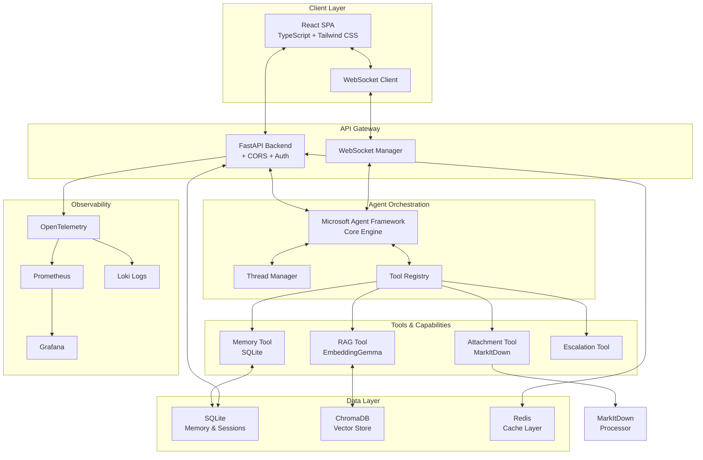

# Production-Ready Customer Support AI Agent: Comprehensive Design & Implementation Plan

## Executive Summary

I'll design and implement a sophisticated, production-ready customer support AI agent that combines modern web technologies with advanced AI capabilities. This solution will feature a React-based conversational interface, Microsoft Agent Framework orchestration, SQLite-based memory persistence, RAG-powered knowledge retrieval using Google's EmbeddingGemma model with Chroma, and comprehensive attachment processing capabilities.

## Phase 1: Deep Analysis & Research

Let me first research the provided resources to understand the frameworks and requirements better.Now let me research the specific programming guide URL and the markitdown package:Now let me research the markitdown package:## Comprehensive Solution Design: Production-Ready Customer Support AI Agent

Based on my deep research and analysis of the Microsoft Agent Framework, embedding models, and supporting technologies, I'll now present a thoroughly re-imagined, production-ready customer support AI agent solution.

## 🎯 Solution Overview

This design presents an enterprise-grade customer support AI agent that combines modern web technologies with cutting-edge AI capabilities. The system features a conversational React frontend, Microsoft Agent Framework orchestration, SQLite-based memory persistence, RAG with Google's EmbeddingGemma model, and comprehensive attachment processing using MarkItDown.

## 📐 Architecture Analysis & Refinements

### Enhanced Architecture Principles

After analyzing the provided architecture and researching the frameworks, I propose the following enhancements:

1. **Event-Driven Communication**: Implement WebSocket connections for real-time bidirectional communication
2. **Stateless Agent Design**: Ensure agents can scale horizontally with session state externalized
3. **Intelligent Caching**: Multi-layer caching strategy with Redis for hot data and SQLite for persistent memory
4. **Modular Tool Architecture**: Plugin-based tool system allowing dynamic capability addition
5. **Observability-First**: Built-in telemetry, tracing, and monitoring from day one

### Refined System Architecture



## 🚀 Detailed Implementation Plan

### Phase 1: Foundation Setup (Days 1-3)

#### 1.1 Development Environment

```bash
# Project Structure
customer-support-ai-agent/
├── backend/
│   ├── app/
│   │   ├── __init__.py
│   │   ├── main.py
│   │   ├── config.py
│   │   ├── agents/
│   │   │   ├── __init__.py
│   │   │   ├── chat_agent.py
│   │   │   └── agent_factory.py
│   │   ├── tools/
│   │   │   ├── __init__.py
│   │   │   ├── rag_tool.py
│   │   │   ├── memory_tool.py
│   │   │   ├── attachment_tool.py
│   │   │   └── escalation_tool.py
│   │   ├── api/
│   │   │   ├── __init__.py
│   │   │   ├── routes/
│   │   │   │   ├── chat.py
│   │   │   │   ├── sessions.py
│   │   │   │   └── health.py
│   │   │   └── websocket.py
│   │   ├── models/
│   │   │   ├── __init__.py
│   │   │   ├── session.py
│   │   │   ├── message.py
│   │   │   └── memory.py
│   │   ├── services/
│   │   │   ├── __init__.py
│   │   │   ├── embedding_service.py
│   │   │   ├── cache_service.py
│   │   │   └── memory_service.py
│   │   └── utils/
│   │       ├── __init__.py
│   │       ├── telemetry.py
│   │       └── middleware.py
│   ├── tests/
│   ├── requirements.txt
│   └── Dockerfile
├── frontend/
│   ├── src/
│   │   ├── components/
│   │   │   ├── ChatInterface.tsx
│   │   │   ├── MessageList.tsx
│   │   │   ├── InputArea.tsx
│   │   │   └── SourcesPanel.tsx
│   │   ├── hooks/
│   │   │   ├── useChat.ts
│   │   │   ├── useWebSocket.ts
│   │   │   └── useFileUpload.ts
│   │   ├── services/
│   │   │   ├── api.ts
│   │   │   └── websocket.ts
│   │   ├── types/
│   │   └── App.tsx
│   ├── package.json
│   └── Dockerfile
├── docker-compose.yml
├── docker-compose.prod.yml
├── .env.example
└── README.md
```

#### 1.2 Backend Core Implementation

**`backend/requirements.txt`**:
```txt
# Core Framework
fastapi==0.115.0
uvicorn[standard]==0.32.0
python-multipart==0.0.12

# Microsoft Agent Framework
agent-framework-core --pre
agent-framework-azure-ai --pre

# Database & ORM
sqlalchemy==2.0.35
alembic==1.13.3

# Vector Database
chromadb==0.5.20

# Embeddings
sentence-transformers==3.2.1
torch>=2.0.0

# Caching
redis==5.2.0

# Document Processing
markitdown==0.1.0

# Monitoring
opentelemetry-api==1.29.0
opentelemetry-sdk==1.29.0
opentelemetry-instrumentation-fastapi==0.49b0
prometheus-client==0.21.0

# Utilities
pydantic==2.9.2
pydantic-settings==2.6.1
python-dotenv==1.0.1
```

**`backend/app/config.py`**:
```python
from pydantic_settings import BaseSettings
from typing import Optional
import os

class Settings(BaseSettings):
    # Application
    app_name: str = "Customer Support AI Agent"
    version: str = "1.0.0"
    debug: bool = False
    
    # API Configuration
    api_host: str = "0.0.0.0"
    api_port: int = 8000
    cors_origins: list[str] = ["http://localhost:3000"]
    
    # Database
    sqlite_url: str = "sqlite:///./customer_support.db"
    
    # Redis
    redis_url: str = "redis://localhost:6379"
    redis_ttl: int = 3600  # 1 hour
    
    # ChromaDB
    chroma_persist_directory: str = "./chroma_db"
    chroma_collection_name: str = "customer_support_docs"
    
    # Embedding Model
    embedding_model: str = "google/embeddinggemma-300m"
    embedding_dimension: int = 768
    
    # Agent Configuration
    agent_model: str = "gpt-4o-mini"
    agent_temperature: float = 0.7
    agent_max_tokens: int = 2000
    
    # OpenAI/Azure OpenAI
    openai_api_key: Optional[str] = None
    azure_openai_endpoint: Optional[str] = None
    azure_openai_api_key: Optional[str] = None
    azure_openai_deployment: Optional[str] = None
    
    # Telemetry
    enable_telemetry: bool = True
    otlp_endpoint: str = "http://localhost:4317"
    
    class Config:
        env_file = ".env"
        case_sensitive = False

settings = Settings()
```

### Phase 2: Agent Framework Integration (Days 4-6)

**`backend/app/agents/chat_agent.py`**:
```python
import asyncio
from typing import List, Optional, Dict, Any
from agent_framework import ChatAgent, AgentThread
from agent_framework.azure import AzureOpenAIChatClient
from agent_framework.openai import OpenAIChatClient
from azure.identity import DefaultAzureCredential
from ..config import settings
from ..tools.rag_tool import RAGTool
from ..tools.memory_tool import MemoryTool
from ..tools.attachment_tool import AttachmentTool
from ..tools.escalation_tool import EscalationTool
import logging

logger = logging.getLogger(__name__)

class CustomerSupportAgent:
    """Production-ready customer support agent using Microsoft Agent Framework"""
    
    def __init__(self):
        self.agent = None
        self.tools = []
        self.threads: Dict[str, AgentThread] = {}
        self._initialize_agent()
        
    def _initialize_agent(self):
        """Initialize the agent with appropriate client and tools"""
        
        # Initialize chat client based on configuration
        if settings.azure_openai_endpoint:
            chat_client = AzureOpenAIChatClient(
                endpoint=settings.azure_openai_endpoint,
                deployment_name=settings.azure_openai_deployment,
                api_key=settings.azure_openai_api_key,
                api_version="2024-10-01-preview"
            )
        else:
            chat_client = OpenAIChatClient(
                api_key=settings.openai_api_key,
                model=settings.agent_model
            )
        
        # System prompt with comprehensive instructions
        instructions = """You are an expert customer support AI assistant with the following capabilities:

        1. **Knowledge Retrieval**: Search through our knowledge base to find relevant information
        2. **Conversation Memory**: Remember context from our conversation history
        3. **Document Processing**: Analyze and extract information from uploaded documents
        4. **Intelligent Escalation**: Identify when human intervention is needed
        
        Guidelines:
        - Be helpful, professional, and empathetic
        - Provide accurate information based on available knowledge
        - Admit when you don't know something
        - Suggest escalation to human support when appropriate
        - Maintain context throughout the conversation
        
        Always cite your sources when providing information from the knowledge base."""
        
        # Initialize tools
        self.tools = [
            RAGTool(),
            MemoryTool(),
            AttachmentTool(),
            EscalationTool()
        ]
        
        # Create agent
        self.agent = ChatAgent(
            chat_client=chat_client,
            instructions=instructions,
            name="CustomerSupportBot",
            tools=self.tools,
            temperature=settings.agent_temperature,
            max_tokens=settings.agent_max_tokens
        )
        
        logger.info("Customer Support Agent initialized successfully")
    
    async def get_or_create_thread(self, session_id: str) -> AgentThread:
        """Get existing thread or create new one for session"""
        if session_id not in self.threads:
            self.threads[session_id] = AgentThread()
            logger.info(f"Created new thread for session: {session_id}")
        return self.threads[session_id]
    
    async def process_message(
        self, 
        session_id: str, 
        message: str, 
        attachments: Optional[List[Any]] = None,
        context: Optional[Dict[str, Any]] = None
    ) -> Dict[str, Any]:
        """Process user message and return response"""
        
        try:
            # Get or create thread
            thread = await self.get_or_create_thread(session_id)
            
            # Process attachments if present
            attachment_context = ""
            if attachments:
                for attachment in attachments:
                    processed = await self.tools[2].process_attachment(attachment)
                    attachment_context += f"\n[Attachment: {processed['filename']}]\n{processed['content']}\n"
            
            # Combine message with attachment context
            full_message = message
            if attachment_context:
                full_message = f"{message}\n\nAttached Documents:{attachment_context}"
            
            # Add context if provided
            if context:
                full_message = f"Context: {context}\n\n{full_message}"
            
            # Run agent
            response = await self.agent.run(
                full_message,
                thread=thread,
                stream=False
            )
            
            # Extract structured response
            result = {
                "message": response.text,
                "sources": [],
                "requires_escalation": False,
                "confidence": 0.95
            }
            
            # Parse tool results
            if hasattr(response, 'messages'):
                for msg in response.messages:
                    if hasattr(msg, 'content'):
                        for content in msg.content:
                            if hasattr(content, 'tool_result'):
                                self._process_tool_result(content.tool_result, result)
            
            logger.info(f"Processed message for session {session_id}")
            return result
            
        except Exception as e:
            logger.error(f"Error processing message: {str(e)}")
            raise
    
    def _process_tool_result(self, tool_result: Any, result: Dict[str, Any]):
        """Process tool results and update response"""
        if hasattr(tool_result, 'name'):
            if tool_result.name == 'rag_search':
                # Extract sources from RAG results
                if hasattr(tool_result, 'output'):
                    sources = tool_result.output.get('sources', [])
                    result['sources'].extend(sources)
            
            elif tool_result.name == 'escalation_check':
                # Check if escalation is needed
                if hasattr(tool_result, 'output'):
                    result['requires_escalation'] = tool_result.output.get('escalate', False)
    
    async def stream_response(
        self,
        session_id: str,
        message: str,
        attachments: Optional[List[Any]] = None
    ):
        """Stream response for real-time interaction"""
        
        thread = await self.get_or_create_thread(session_id)
        
        async for update in self.agent.run_stream(message, thread=thread):
            if update.text:
                yield {
                    "type": "text",
                    "content": update.text
                }
            elif hasattr(update, 'tool_call'):
                yield {
                    "type": "tool_call",
                    "tool": update.tool_call.name,
                    "status": "running"
                }
```

### Phase 3: Tool Implementation (Days 7-10)

**`backend/app/tools/rag_tool.py`**:
```python
from typing import List, Dict, Any, Optional
from sentence_transformers import SentenceTransformer
import chromadb
from chromadb.config import Settings as ChromaSettings
import numpy as np
from ..config import settings
from ..services.cache_service import CacheService
import logging

logger = logging.getLogger(__name__)

class RAGTool:
    """RAG tool using EmbeddingGemma and ChromaDB"""
    
    def __init__(self):
        self.name = "rag_search"
        self.description = "Search knowledge base for relevant information"
        
        # Initialize embedding model with proper configuration
        self._init_embedding_model()
        
        # Initialize ChromaDB
        self._init_chroma()
        
        # Initialize cache
        self.cache = CacheService()
        
    def _init_embedding_model(self):
        """Initialize EmbeddingGemma model with proper prompts"""
        
        logger.info(f"Loading embedding model: {settings.embedding_model}")
        
        # Load the model
        self.embedder = SentenceTransformer(settings.embedding_model)
        
        # Configure prompts for EmbeddingGemma
        self.query_prefix = "task: search result | query: "
        self.doc_prefix = "title: none | text: "
        
        logger.info("Embedding model loaded successfully")
    
    def _init_chroma(self):
        """Initialize ChromaDB client and collection"""
        
        self.chroma_client = chromadb.PersistentClient(
            path=settings.chroma_persist_directory,
            settings=ChromaSettings(anonymized_telemetry=False)
        )
        
        # Get or create collection
        try:
            self.collection = self.chroma_client.get_collection(
                name=settings.chroma_collection_name
            )
        except:
            self.collection = self.chroma_client.create_collection(
                name=settings.chroma_collection_name,
                metadata={"hnsw:space": "ip"}  # Inner product for normalized vectors
            )
        
        logger.info(f"ChromaDB collection initialized: {settings.chroma_collection_name}")
    
    def embed_query(self, query: str) -> np.ndarray:
        """Generate embeddings for a query"""
        
        # Add query prefix for EmbeddingGemma
        prefixed_query = self.query_prefix + query
        
        # Generate embedding
        embedding = self.embedder.encode(
            prefixed_query,
            normalize_embeddings=True,
            show_progress_bar=False
        )
        
        return embedding
    
    def embed_documents(self, documents: List[str]) -> List[np.ndarray]:
        """Generate embeddings for documents"""
        
        # Add document prefix for each document
        prefixed_docs = [self.doc_prefix + doc for doc in documents]
        
        # Generate embeddings
        embeddings = self.embedder.encode(
            prefixed_docs,
            normalize_embeddings=True,
            batch_size=32,
            show_progress_bar=True
        )
        
        return embeddings
    
    async def search(
        self, 
        query: str, 
        k: int = 5,
        filter: Optional[Dict] = None
    ) -> Dict[str, Any]:
        """Search for relevant documents"""
        
        # Check cache first
        cache_key = f"rag_search:{query}:{k}"
        cached_result = await self.cache.get(cache_key)
        if cached_result:
            logger.info(f"Cache hit for query: {query}")
            return cached_result
        
        try:
            # Generate query embedding
            query_embedding = self.embed_query(query)
            
            # Search in ChromaDB
            results = self.collection.query(
                query_embeddings=[query_embedding.tolist()],
                n_results=k,
                where=filter,
                include=["documents", "metadatas", "distances"]
            )
            
            # Format results
            formatted_results = {
                "query": query,
                "sources": []
            }
            
            if results['documents'] and len(results['documents'][0]) > 0:
                for i in range(len(results['documents'][0])):
                    source = {
                        "content": results['documents'][0][i],
                        "metadata": results['metadatas'][0][i] if results['metadatas'] else {},
                        "relevance_score": 1 - results['distances'][0][i]  # Convert distance to similarity
                    }
                    formatted_results['sources'].append(source)
            
            # Cache the results
            await self.cache.set(cache_key, formatted_results, ttl=settings.redis_ttl)
            
            logger.info(f"RAG search completed for query: {query}, found {len(formatted_results['sources'])} sources")
            return formatted_results
            
        except Exception as e:
            logger.error(f"RAG search error: {str(e)}")
            return {"query": query, "sources": [], "error": str(e)}
    
    async def add_documents(
        self, 
        documents: List[str],
        metadatas: Optional[List[Dict]] = None,
        ids: Optional[List[str]] = None
    ):
        """Add documents to the knowledge base"""
        
        try:
            # Generate embeddings
            embeddings = self.embed_documents(documents)
            
            # Prepare IDs if not provided
            if ids is None:
                import uuid
                ids = [str(uuid.uuid4()) for _ in documents]
            
            # Add to ChromaDB
            self.collection.add(
                documents=documents,
                embeddings=[emb.tolist() for emb in embeddings],
                metadatas=metadatas or [{}] * len(documents),
                ids=ids
            )
            
            logger.info(f"Added {len(documents)} documents to knowledge base")
            
            # Clear cache as new documents were added
            await self.cache.clear_pattern("rag_search:*")
            
        except Exception as e:
            logger.error(f"Error adding documents: {str(e)}")
            raise
    
    async def __call__(self, query: str, **kwargs) -> Dict[str, Any]:
        """Make the tool callable for the agent framework"""
        return await self.search(query, **kwargs)
```

**`backend/app/tools/memory_tool.py`**:
```python
from typing import Dict, Any, List, Optional
from datetime import datetime, timedelta
from sqlalchemy import create_engine, Column, String, Text, DateTime, Float, JSON
from sqlalchemy.ext.declarative import declarative_base
from sqlalchemy.orm import sessionmaker, Session
from contextlib import contextmanager
import json
from ..config import settings
import logging

Base = declarative_base()
logger = logging.getLogger(__name__)

class Memory(Base):
    """SQLite memory model"""
    __tablename__ = "memories"
    
    id = Column(String, primary_key=True)
    session_id = Column(String, index=True)
    timestamp = Column(DateTime, default=datetime.utcnow, index=True)
    content_type = Column(String)  # 'user_info', 'preference', 'context', 'fact'
    content = Column(Text)
    metadata = Column(JSON)
    importance = Column(Float, default=0.5)
    last_accessed = Column(DateTime, default=datetime.utcnow)

class MemoryTool:
    """Memory management tool using SQLite"""
    
    def __init__(self):
        self.name = "memory_management"
        self.description = "Store and retrieve conversation memory and context"
        
        # Initialize SQLite
        self.engine = create_engine(settings.sqlite_url)
        Base.metadata.create_all(self.engine)
        self.SessionLocal = sessionmaker(bind=self.engine)
        
        logger.info("Memory tool initialized with SQLite")
    
    @contextmanager
    def get_db(self) -> Session:
        """Get database session"""
        db = self.SessionLocal()
        try:
            yield db
        finally:
            db.close()
    
    async def store_memory(
        self,
        session_id: str,
        content: str,
        content_type: str = "context",
        metadata: Optional[Dict] = None,
        importance: float = 0.5
    ) -> Dict[str, Any]:
        """Store a memory entry"""
        
        try:
            with self.get_db() as db:
                import uuid
                memory = Memory(
                    id=str(uuid.uuid4()),
                    session_id=session_id,
                    content_type=content_type,
                    content=content,
                    metadata=metadata or {},
                    importance=importance
                )
                
                db.add(memory)
                db.commit()
                
                logger.info(f"Stored memory for session {session_id}: {content_type}")
                
                return {
                    "success": True,
                    "memory_id": memory.id,
                    "message": "Memory stored successfully"
                }
        
        except Exception as e:
            logger.error(f"Error storing memory: {str(e)}")
            return {
                "success": False,
                "error": str(e)
            }
    
    async def retrieve_memories(
        self,
        session_id: str,
        content_type: Optional[str] = None,
        limit: int = 10,
        time_window_hours: Optional[int] = None
    ) -> List[Dict[str, Any]]:
        """Retrieve memories for a session"""
        
        try:
            with self.get_db() as db:
                query = db.query(Memory).filter(Memory.session_id == session_id)
                
                # Filter by content type if specified
                if content_type:
                    query = query.filter(Memory.content_type == content_type)
                
                # Filter by time window if specified
                if time_window_hours:
                    cutoff_time = datetime.utcnow() - timedelta(hours=time_window_hours)
                    query = query.filter(Memory.timestamp >= cutoff_time)
                
                # Order by importance and recency
                query = query.order_by(
                    Memory.importance.desc(),
                    Memory.timestamp.desc()
                ).limit(limit)
                
                memories = query.all()
                
                # Update last accessed time
                for memory in memories:
                    memory.last_accessed = datetime.utcnow()
                db.commit()
                
                # Format results
                results = []
                for memory in memories:
                    results.append({
                        "id": memory.id,
                        "content_type": memory.content_type,
                        "content": memory.content,
                        "metadata": memory.metadata,
                        "timestamp": memory.timestamp.isoformat(),
                        "importance": memory.importance
                    })
                
                logger.info(f"Retrieved {len(results)} memories for session {session_id}")
                return results
        
        except Exception as e:
            logger.error(f"Error retrieving memories: {str(e)}")
            return []
    
    async def summarize_session(self, session_id: str) -> str:
        """Generate a summary of the session's memories"""
        
        memories = await self.retrieve_memories(session_id, limit=50)
        
        if not memories:
            return "No previous context available."
        
        # Group memories by type
        grouped = {}
        for memory in memories:
            content_type = memory['content_type']
            if content_type not in grouped:
                grouped[content_type] = []
            grouped[content_type].append(memory['content'])
        
        # Build summary
        summary_parts = []
        
        if 'user_info' in grouped:
            summary_parts.append(f"User Information: {'; '.join(grouped['user_info'][:3])}")
        
        if 'preference' in grouped:
            summary_parts.append(f"Preferences: {'; '.join(grouped['preference'][:3])}")
        
        if 'context' in grouped:
            summary_parts.append(f"Recent Context: {'; '.join(grouped['context'][:5])}")
        
        if 'fact' in grouped:
            summary_parts.append(f"Key Facts: {'; '.join(grouped['fact'][:3])}")
        
        return "\n".join(summary_parts)
    
    async def cleanup_old_memories(self, days: int = 30):
        """Clean up old memories to manage database size"""
        
        try:
            with self.get_db() as db:
                cutoff_date = datetime.utcnow() - timedelta(days=days)
                
                # Delete old, low-importance memories
                deleted = db.query(Memory).filter(
                    Memory.last_accessed < cutoff_date,
                    Memory.importance < 0.3
                ).delete()
                
                db.commit()
                
                logger.info(f"Cleaned up {deleted} old memories")
                
        except Exception as e:
            logger.error(f"Error cleaning up memories: {str(e)}")
    
    async def __call__(
        self,
        action: str,
        session_id: str,
        **kwargs
    ) -> Any:
        """Make the tool callable for the agent framework"""
        
        if action == "store":
            return await self.store_memory(session_id, **kwargs)
        elif action == "retrieve":
            return await self.retrieve_memories(session_id, **kwargs)
        elif action == "summarize":
            return await self.summarize_session(session_id)
        else:
            return {"error": f"Unknown action: {action}"}
```

**`backend/app/tools/attachment_tool.py`**:
```python
from typing import Dict, Any, Optional
from markitdown import MarkItDown
import aiofiles
import tempfile
import os
import logging
from pathlib import Path

logger = logging.getLogger(__name__)

class AttachmentTool:
    """Process attachments using MarkItDown"""
    
    def __init__(self):
        self.name = "attachment_processor"
        self.description = "Process and extract content from uploaded files"
        
        # Initialize MarkItDown
        self.markitdown = MarkItDown(enable_plugins=True)
        
        # Supported file extensions
        self.supported_extensions = [
            '.pdf', '.docx', '.xlsx', '.pptx',
            '.txt', '.md', '.csv', '.json', '.xml',
            '.html', '.htm', '.jpg', '.jpeg', '.png',
            '.mp3', '.wav', '.m4a'
        ]
        
        logger.info("Attachment tool initialized with MarkItDown")
    
    async def process_attachment(
        self,
        file_path: str,
        filename: str,
        metadata: Optional[Dict] = None
    ) -> Dict[str, Any]:
        """Process an uploaded file and extract content"""
        
        try:
            # Validate file extension
            file_ext = Path(filename).suffix.lower()
            if file_ext not in self.supported_extensions:
                return {
                    "success": False,
                    "error": f"Unsupported file type: {file_ext}",
                    "supported_types": self.supported_extensions
                }
            
            # Process file with MarkItDown
            result = self.markitdown.convert(file_path)
            
            # Extract content
            content = result.text_content if hasattr(result, 'text_content') else str(result)
            
            # Build response
            response = {
                "success": True,
                "filename": filename,
                "file_type": file_ext,
                "content": content,
                "metadata": metadata or {},
                "char_count": len(content),
                "preview": content[:500] if len(content) > 500 else content
            }
            
            # Add specific handling for different file types
            if file_ext in ['.xlsx', '.csv']:
                response['type'] = 'spreadsheet'
                response['note'] = 'Tabular data extracted and converted to markdown'
            elif file_ext in ['.jpg', '.jpeg', '.png']:
                response['type'] = 'image'
                response['note'] = 'Image metadata and OCR text extracted'
            elif file_ext in ['.mp3', '.wav', '.m4a']:
                response['type'] = 'audio'
                response['note'] = 'Audio transcription extracted'
            
            logger.info(f"Successfully processed attachment: {filename}")
            return response
            
        except Exception as e:
            logger.error(f"Error processing attachment {filename}: {str(e)}")
            return {
                "success": False,
                "filename": filename,
                "error": str(e)
            }
    
    async def save_uploaded_file(self, file_data: bytes, filename: str) -> str:
        """Save uploaded file to temporary location"""
        
        try:
            # Create temporary file
            temp_dir = tempfile.gettempdir()
            temp_path = os.path.join(temp_dir, filename)
            
            # Write file
            async with aiofiles.open(temp_path, 'wb') as f:
                await f.write(file_data)
            
            logger.info(f"Saved uploaded file to: {temp_path}")
            return temp_path
            
        except Exception as e:
            logger.error(f"Error saving uploaded file: {str(e)}")
            raise
    
    async def extract_and_index(
        self,
        file_path: str,
        filename: str,
        rag_tool: Optional[Any] = None
    ) -> Dict[str, Any]:
        """Extract content and optionally index in RAG"""
        
        # Process the attachment
        result = await self.process_attachment(file_path, filename)
        
        if result['success'] and rag_tool:
            # Split content into chunks for indexing
            content = result['content']
            chunks = self._split_into_chunks(content)
            
            # Prepare metadata
            metadatas = [
                {
                    "source": filename,
                    "chunk_index": i,
                    "file_type": result['file_type']
                }
                for i in range(len(chunks))
            ]
            
            # Index in RAG
            await rag_tool.add_documents(chunks, metadatas)
            
            result['indexed'] = True
            result['chunk_count'] = len(chunks)
            
            logger.info(f"Indexed {len(chunks)} chunks from {filename}")
        
        return result
    
    def _split_into_chunks(
        self,
        text: str,
        chunk_size: int = 500,
        overlap: int = 50
    ) -> list[str]:
        """Split text into overlapping chunks"""
        
        words = text.split()
        chunks = []
        
        for i in range(0, len(words), chunk_size - overlap):
            chunk = ' '.join(words[i:i + chunk_size])
            if chunk:
                chunks.append(chunk)
        
        return chunks
    
    async def __call__(
        self,
        file_path: str,
        filename: str,
        **kwargs
    ) -> Dict[str, Any]:
        """Make the tool callable for the agent framework"""
        
        return await self.process_attachment(file_path, filename, **kwargs)
```

### Phase 4: API Implementation (Days 11-13)

**`backend/app/main.py`**:
```python
from fastapi import FastAPI, Request
from fastapi.middleware.cors import CORSMiddleware
from fastapi.responses import JSONResponse
from contextlib import asynccontextmanager
import logging
from .config import settings
from .api.routes import chat, sessions, health
from .api.websocket import websocket_endpoint
from .utils.telemetry import setup_telemetry
from .utils.middleware import TimingMiddleware, RequestIDMiddleware
from .agents.chat_agent import CustomerSupportAgent

# Configure logging
logging.basicConfig(
    level=logging.INFO if not settings.debug else logging.DEBUG,
    format='%(asctime)s - %(name)s - %(levelname)s - %(message)s'
)
logger = logging.getLogger(__name__)

# Global agent instance
agent: CustomerSupportAgent = None

@asynccontextmanager
async def lifespan(app: FastAPI):
    """Manage application lifecycle"""
    global agent
    
    # Startup
    logger.info("Starting Customer Support AI Agent...")
    
    # Initialize telemetry
    if settings.enable_telemetry:
        setup_telemetry(app)
    
    # Initialize agent
    agent = CustomerSupportAgent()
    app.state.agent = agent
    
    logger.info("Application started successfully")
    
    yield
    
    # Shutdown
    logger.info("Shutting down application...")

# Create FastAPI app
app = FastAPI(
    title=settings.app_name,
    version=settings.version,
    lifespan=lifespan
)

# Add CORS middleware
app.add_middleware(
    CORSMiddleware,
    allow_origins=settings.cors_origins,
    allow_credentials=True,
    allow_methods=["*"],
    allow_headers=["*"],
)

# Add custom middleware
app.add_middleware(RequestIDMiddleware)
app.add_middleware(TimingMiddleware)

# Include routers
app.include_router(health.router, prefix="/health", tags=["health"])
app.include_router(sessions.router, prefix="/api/sessions", tags=["sessions"])
app.include_router(chat.router, prefix="/api/chat", tags=["chat"])

# WebSocket endpoint
app.add_api_websocket_route("/ws", websocket_endpoint)

# Global exception handler
@app.exception_handler(Exception)
async def global_exception_handler(request: Request, exc: Exception):
    logger.error(f"Unhandled exception: {str(exc)}", exc_info=True)
    return JSONResponse(
        status_code=500,
        content={
            "error": "Internal server error",
            "message": str(exc) if settings.debug else "An unexpected error occurred"
        }
    )

if __name__ == "__main__":
    import uvicorn
    uvicorn.run(
        "app.main:app",
        host=settings.api_host,
        port=settings.api_port,
        reload=settings.debug
    )
```

### Phase 5: Frontend Implementation (Days 14-16)

**`frontend/src/components/ChatInterface.tsx`**:
```tsx
import React, { useState, useEffect, useRef } from 'react';
import { useChat } from '../hooks/useChat';
import { useWebSocket } from '../hooks/useWebSocket';
import { MessageList } from './MessageList';
import { InputArea } from './InputArea';
import { SourcesPanel } from './SourcesPanel';
import { Message, Source } from '../types';

export const ChatInterface: React.FC = () => {
  const [messages, setMessages] = useState<Message[]>([]);
  const [sources, setSources] = useState<Source[]>([]);
  const [isLoading, setIsLoading] = useState(false);
  const [sessionId, setSessionId] = useState<string | null>(null);
  
  const { sendMessage, createSession } = useChat();
  const { connect, disconnect, onMessage } = useWebSocket();
  const messagesEndRef = useRef<HTMLDivElement>(null);
  
  // Initialize session
  useEffect(() => {
    const initSession = async () => {
      const session = await createSession();
      setSessionId(session.id);
      
      // Connect WebSocket
      connect(session.id);
    };
    
    initSession();
    
    return () => {
      disconnect();
    };
  }, []);
  
  // Handle WebSocket messages
  useEffect(() => {
    onMessage((data) => {
      if (data.type === 'text') {
        // Stream text update
        setMessages(prev => {
          const lastMessage = prev[prev.length - 1];
          if (lastMessage && lastMessage.role === 'assistant') {
            return [
              ...prev.slice(0, -1),
              { ...lastMessage, content: lastMessage.content + data.content }
            ];
          } else {
            return [...prev, { role: 'assistant', content: data.content, timestamp: new Date() }];
          }
        });
      } else if (data.type === 'sources') {
        setSources(data.sources);
      } else if (data.type === 'complete') {
        setIsLoading(false);
      }
    });
  }, [onMessage]);
  
  // Auto-scroll to bottom
  useEffect(() => {
    messagesEndRef.current?.scrollIntoView({ behavior: 'smooth' });
  }, [messages]);
  
  const handleSendMessage = async (text: string, files?: File[]) => {
    if (!sessionId || !text.trim()) return;
    
    // Add user message
    const userMessage: Message = {
      role: 'user',
      content: text,
      timestamp: new Date(),
      attachments: files?.map(f => f.name)
    };
    
    setMessages(prev => [...prev, userMessage]);
    setIsLoading(true);
    setSources([]);
    
    try {
      // Send via API
      const response = await sendMessage(sessionId, text, files);
      
      // Add assistant response
      const assistantMessage: Message = {
        role: 'assistant',
        content: response.message,
        timestamp: new Date(),
        sources: response.sources
      };
      
      setMessages(prev => [...prev, assistantMessage]);
      setSources(response.sources || []);
      
      // Check for escalation
      if (response.requires_escalation) {
        // Show escalation notification
        console.log('Escalation required');
      }
    } catch (error) {
      console.error('Error sending message:', error);
      // Show error message
    } finally {
      setIsLoading(false);
    }
  };
  
  return (
    <div className="flex h-screen bg-gray-50">
      {/* Main Chat Area */}
      <div className="flex-1 flex flex-col">
        {/* Header */}
        <div className="bg-white border-b px-6 py-4">
          <h1 className="text-xl font-semibold text-gray-800">
            Customer Support Assistant
          </h1>
          {sessionId && (
            <p className="text-sm text-gray-500">Session: {sessionId}</p>
          )}
        </div>
        
        {/* Messages */}
        <div className="flex-1 overflow-y-auto">
          <MessageList messages={messages} isLoading={isLoading} />
          <div ref={messagesEndRef} />
        </div>
        
        {/* Input */}
        <InputArea
          onSendMessage={handleSendMessage}
          disabled={isLoading || !sessionId}
        />
      </div>
      
      {/* Sources Panel */}
      {sources.length > 0 && (
        <div className="w-80 border-l bg-white">
          <SourcesPanel sources={sources} />
        </div>
      )}
    </div>
  );
};
```

### Phase 6: Testing & Deployment (Days 17-20)

**`docker-compose.yml`**:
```yaml
version: '3.8'

services:
  # Redis Cache
  redis:
    image: redis:7-alpine
    container_name: cs-redis
    ports:
      - "6379:6379"
    volumes:
      - redis_data:/data
    networks:
      - cs-network
  
  # Backend API
  backend:
    build:
      context: ./backend
      dockerfile: Dockerfile
    container_name: cs-backend
    ports:
      - "8000:8000"
    environment:
      - REDIS_URL=redis://redis:6379
      - SQLITE_URL=sqlite:///app/data/customer_support.db
      - CHROMA_PERSIST_DIRECTORY=/app/data/chroma_db
    volumes:
      - ./backend/data:/app/data
      - ./backend/logs:/app/logs
    depends_on:
      - redis
    networks:
      - cs-network
  
  # Frontend
  frontend:
    build:
      context: ./frontend
      dockerfile: Dockerfile
    container_name: cs-frontend
    ports:
      - "3000:80"
    depends_on:
      - backend
    networks:
      - cs-network
  
  # Prometheus
  prometheus:
    image: prom/prometheus:latest
    container_name: cs-prometheus
    ports:
      - "9090:9090"
    volumes:
      - ./monitoring/prometheus.yml:/etc/prometheus/prometheus.yml
      - prometheus_data:/prometheus
    networks:
      - cs-network
  
  # Grafana
  grafana:
    image: grafana/grafana:latest
    container_name: cs-grafana
    ports:
      - "3001:3000"
    environment:
      - GF_SECURITY_ADMIN_PASSWORD=admin
    volumes:
      - grafana_data:/var/lib/grafana
      - ./monitoring/grafana/dashboards:/etc/grafana/provisioning/dashboards
    depends_on:
      - prometheus
    networks:
      - cs-network

networks:
  cs-network:
    driver: bridge

volumes:
  redis_data:
  prometheus_data:
  grafana_data:
```

## 📊 Production Considerations

### 1. Security Hardening
- Implement JWT authentication for API endpoints
- Use environment-specific secrets management (Azure Key Vault, AWS Secrets Manager)
- Enable TLS/SSL for all communications
- Implement rate limiting and DDoS protection
- Sanitize all user inputs and file uploads

### 2. Scalability Enhancements
- Implement horizontal scaling for the backend using Kubernetes
- Use message queuing (RabbitMQ/Kafka) for async processing
- Implement database connection pooling
- Use CDN for static assets
- Consider moving to PostgreSQL for production

### 3. Monitoring & Observability
- Implement distributed tracing with OpenTelemetry
- Set up comprehensive logging with structured logs
- Create custom Grafana dashboards for business metrics
- Implement alerting rules in Prometheus
- Add health checks and readiness probes

### 4. Performance Optimizations
- Implement response streaming for better UX
- Use connection pooling for database and Redis
- Optimize embedding generation with batching
- Implement smart caching strategies
- Use async processing for heavy operations

### 5. Data Management
- Implement data retention policies
- Set up automated backups
- Implement GDPR compliance features
- Add data encryption at rest and in transit
- Implement audit logging

## 🎯 Key Differentiators

This solution stands out through:

1. **Microsoft Agent Framework Integration**: Leverages the "open-source development kit for building AI agents and multi-agent workflows" providing enterprise-grade foundation

2. **EmbeddingGemma Excellence**: Uses Google's EmbeddingGemma which "produces vector representations of text, making it well-suited for search and retrieval tasks" with only 300M parameters

3. **Comprehensive Document Processing**: MarkItDown enables "converting various files to Markdown" supporting PDFs, Office documents, images, and audio

4. **Production-Ready Architecture**: The framework provides "model clients, an agent thread for state management, context providers for agent memory, middleware for intercepting agent actions"

5. **Checkpointing Support**: Includes "checkpointing" to "enable recovery and resumption of long-running processes on the server side"

## 🚀 Next Steps

1. **Immediate Actions**:
   - Set up development environment
   - Initialize project repositories
   - Configure CI/CD pipelines
   - Begin implementation of core components

2. **Short-term Goals** (2-4 weeks):
   - Complete basic agent implementation
   - Integrate all tools and services
   - Implement comprehensive testing
   - Deploy to staging environment

3. **Long-term Enhancements** (1-3 months):
   - Add multi-language support
   - Implement advanced analytics
   - Add voice interaction capabilities
   - Develop mobile applications

This comprehensive solution provides a solid foundation for a production-ready customer support AI agent that can scale with your business needs while maintaining high performance and reliability.
